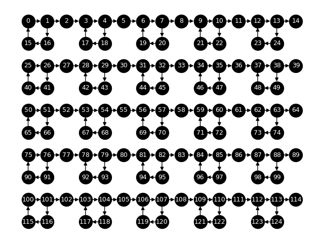

# Network of Oscillators

Contributors: J. Parker Mitchell and Catherine D. Schuman

Repository created: 2019

In this task, we construct a frequency oscillator consisting of recurrent loops. This task serves as an interesting method to examine characteristics of differing systems because the activity pattern within the oscillator may be matched across varying hardware implementations.

We use a small network of 4-stage oscillators that are tiled in a 5x5 arrangement:

Oscillators in a row are chained together with one intermediate neuron between each. Each neuron should have a low threshold and each synapse should have a strong enough positive weight that it can trigger its post-synaptic neuron to fire. Delays (synaptic and/or neuronal) should be such that, once stimulated, one neuron in each 4-stage oscillator should fire every time step.  With a network of this structure, a single input spike should be applied on each input neuron at time 0.  The task is to generate 10 spikes on each output neuron; in particular, once the first output fire occurs, the remaining output fires should occur every fourth time step. 

A network description file is available in `network.gml` as a GML directed graph.  The expected spike raster plot is:

The spike raster data is given in `activity.log`. Each line is formatted as a space delimited time, neuron pair.

## Metrics to Report
When reporting results for this task, the following metrics should be reported:
- Energy required to complete the task (generate 10 spikes for each output neuron) on the neuromorphic implementation.
- Size of the resulting network in neurons and synapses.  Though the graph is pre-specified, as noted above, the embedding of the graph may require additional structure. 
