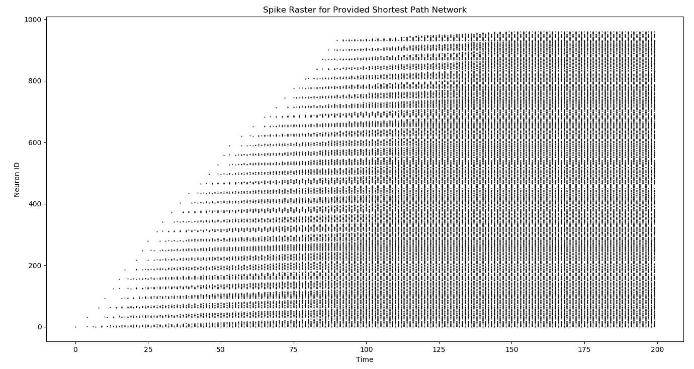

# Single Source Shortest Path Distance Calculation

Contributors: Catherine D. Schuman and J. Parker Mitchell

We propose using a graph inspired by the way that a city's road network is designed, where each node corresponds to an intersection and each edge corresponds to a road segment between intersections.  This is a weighted, directed graph that has `|N|=961` nodes and `|E|=2280` edges.  We translate this graph into an SNN amenable for neuromorphic implementation.  Every node in the graph becomes a neuron in the SNN with a low threshold value.  Every edge in the graph becomes a synapse in the network, where the weight of the synapse is higher than the neuron threshold value and the delays are proportional to the the corresponding edge's weight.   The delays should be set such that if A and B are nodes in the original graph and there is an edge from A to B with weight or length of `d`, and their corresponding neurons are `n_A` and `n_B`, then if `n_A` fires at time 0, `n_B` should fire at time `d`.  In some implementations this may be a direct mapping.  In others, it may require small adaptations in the embedding to ensure the same functionality.  Additionally, if the neuromorphic implementation's synapses are incapable of realizing larger delay values, then multiple synapses with smaller delay values intermediate neurons should be chained together to achieve the same functionality as having a single synapse with larger delay.  If the implementation's synapses are incapable of realizing any delay and the delays are instead built into the neurons, the embedding should be adapted accordingly. 

Once the corresponding SNN has been built, the source node's neuron should be set as an input and the neurons corresponding to the remaining nodes should be monitored to see when they fire as the network activity commences.  The source neuron should be stimulated with a single spike value and the network should be allowed to run for at least 200 time steps, which will allow the spikes to propagate throughout the network.  Then, the fire times of the remaining neurons can be used to define the length of the shortest path from the source node is to each of the other nodes in the graph. In particular, the time of the first fire on each neuron in the graph gives the length of the shortest path from the source node to that destination node. 

A network description file is available in `network.gml` as a GML directed graph. The expected spike raster plot for the provided network is:

The spike raster data is given in `activity.log`. Each line is formatted as a space delimited time,neuron pair.

## Metrics to Report
The following metrics should be reported for this task:
- Energy required to complete the task on the neuromorphic implementation. 
- Size of the resulting network in neurons and synapses.  Though the graph is pre-specified, as noted above, the embedding of the graph may require additional structure. 

